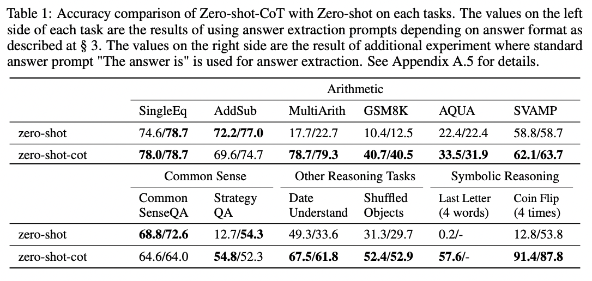
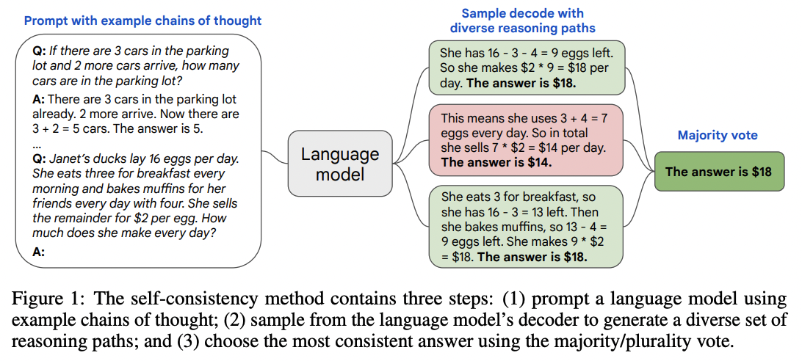
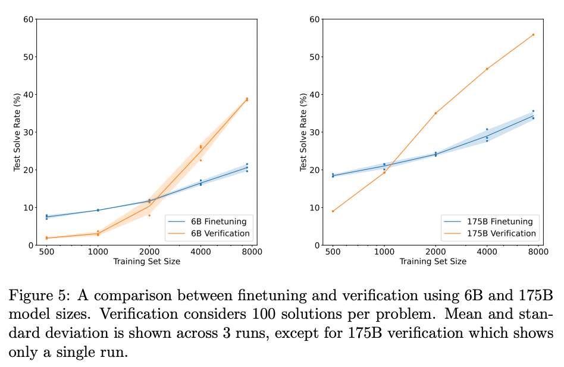
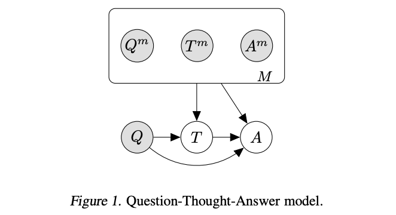
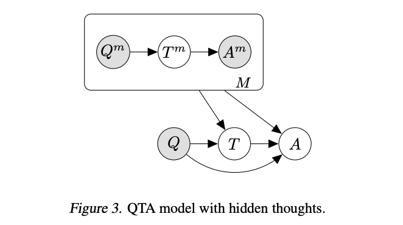
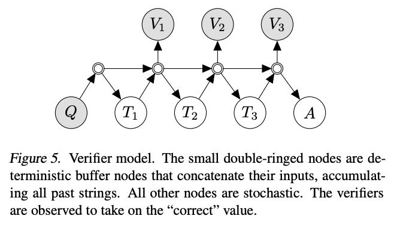

# 提高可靠性的技术

当 GPT-3 在任务中失败时，你该怎么办？

- 寻找更好的提示，以产生更可靠的答案？
- 投入数千个示例来微调自定义模型？
- 假设模型无法完成任务，然后继续？

没有简单的答案 - 这取决于情况。然而，如果你的任务涉及逻辑推理或复杂性，请考虑尝试本文中的技术来构建更可靠且高效的提示。

## GPT-3 无法完成复杂任务的原因

如果你被要求计算 13 乘以 17，答案会立即在你的脑海中出现吗？对于我们大多数人来说，可能不会。然而，这并不意味着人类无法完成两位数乘法。通过几秒钟的思考和用笔纸计算，算出 13 x 17 = 130 + 70 + 21 = 221 并不困难。

同样地，如果你给 GPT-3 一个在计算其下一个标记所需时间内无法完成的任务，它可能会产生错误的猜测。然而，类似于人类，这并不一定意味着模型无法完成任务。在一些时间和空间上推理事情后，模型仍然可能能够可靠地回答问题。

举个例子，如果你让 `text-davinci-002` 回答以下有关抛球的数学问题，它会回答错误：

```text-davinci-002
Q: A juggler has 16 balls. Half of the balls are golf balls and half of the golf balls are blue. How many blue golf balls are there?
A:
```

```text-davinci-002
There are 8 blue golf balls.
```

这是否意味着 GPT-3 无法解决简单的数学问题？不是的；事实上，通过提示模型“让我们逐步思考”，模型可可靠地解决问题：

```text-davinci-002
Q: A juggler has 16 balls. Half of the balls are golf balls and half of the golf balls are blue. How many blue golf balls are there?
A: 让我们想一想每一步。
```

```text-davinci-002
There are 16 balls in total. 
Half of the balls are golf balls. 
That means that there are 8 golf balls. 
Half of the golf balls are blue.
```
格式：只返回翻译内容，不包括原文。这意味着有4个蓝色高尔夫球。

当然，仅仅从一个例子很难知道这种“我们来逐步思考”的技巧是否真的适用于所有问题，还是只是在这个特定的问题上有了好运气。但这确实有效。在一项单词数学问题的基准测试中，“我们来逐步思考”的技巧将GPT-3的解决率大大提高了，从无用的18%提高到了相当不错的79%！

## 模型的能力取决于上下文

在学习如何使用GPT-3时，一个常见的概念错误是认为它的能力在所有情境下都是固定的。例如，如果GPT-3在一个简单的逻辑问题上答错了，那么它一定无法处理简单的逻辑。

但是正如“我们来逐步思考”的例子所说明的那样，GPT-3的表现不佳有时可以通过更好的提示来加以纠正，这有助于模型朝着正确的输出方向引导自己。

## 如何提高复杂任务的可靠性

本文的其余部分将分享有关如何提高大型语言模型在复杂任务上的可靠性的技术。虽然其中一些技术是针对特定类型的问题的，但其中许多都是基于可以应用于各种任务的通用原则，例如：

- 提供更清晰的说明
- 将复杂任务分解为简单的子任务
- 结构化说明以使模型保持在任务上
- 在回答之前提示模型进行解释
- 要求对许多可能的答案进行解释，然后进行综合
- 生成许多输出，然后使用模型选择最佳输出
- 对自定义模型进行微调以最大化性能

## 将复杂任务分解为较简单的任务

给模型更多时间和空间思考的一种方法是将任务分解为较简单的部分。

例如，考虑一个任务，我们向模型提出有关某些文本的多项选择题 - 在这种情况下，是一个谋杀游戏的Clue。当直接询问时，“text-davinci-002”无法将线索3和5联系在一起，答案不正确：

```text-davinci-002
使用以下线索回答以下多项选择题。

线索:“。
格式：仅返回翻译的内容，不包括原始文本。"1. Scarlett 小姐是休息室中唯一的人。
2. 拿着烟斗的人在厨房里。
3. Mustard 上校是天文台中唯一的人。
4. Plum 教授既不在图书馆也不在台球房。
5. 拿着烛台的人在天文台里。

问题：Mustard 上校是否在天文台里持烛台？
(a) 是的；Mustard 上校在天文台里持烛台。
(b) 不是；Mustard 上校不在天文台里持烛台。
(c) 不确定；没有足够的信息来确定是否 Mustard 上校在天文台 with the candlestick。

解答：
```
 
```text-davinci-002
(c) 不确定；没有足够的信息来确定是否 Mustard 上校在天文台 with the candlestick。
```
 
虽然线索 3 和 5 表明 Mustard 上校是天文台中唯一的人且天文台中的人拿着烛台，但是这些信息并没有被结合成正确答案 (a) Yes。

但是，我们可以将问题拆分成三个步骤：
 
- 首先，逐个考虑线索并确定哪些是相关的。
- 其次，将相关的线索组合起来，推理出问题的答案。
- 第三，给出最终答案：即 (a)、(b) 或 (c)。

```text-davinci-002
使用以下线索回答以下多项选择题，使用以下步骤：
(1) 首先，逐个考虑线索并确定哪些是相关的。
(2) 其次，将相关的线索组合起来，推理出问题的答案。
(3) 最后，给出最终答案：即 (a)、(b) 或 (c)。

线索：
1. Scarlett 小姐是休息室中唯一的人。
2. 拿着烟斗的人在厨房里。
3. Mustard 上校是天文台中唯一的人。
4. Plum 教授既不在图书馆也不在台球房。
5. 拿着烛台的人在天文台里。
```问题：Colonel Mustard是否是拿着烛台在天文台里的？
(a)是的；Colonel Mustard拿着烛台在天文台里
(b)不是；Colonel Mustard不是拿着烛台在天文台里
(c)未知；没有足够的信息来确定Colonel Mustard是否是拿着烛台在天文台里
 
解答：
(1) 首先，逐一检查每个线索，判断线索是否有潜在的相关性：
```
 
```text-davinci-002
线索1：只有Miss Scarlett一个人在休息室。此线索不相关。
线索2：拿着烟斗的人在厨房里。此线索不相关。
线索3：只有Colonel Mustard一个人在天文台里。此线索相关。
线索4：Professor Plum既不在图书馆也不在台球房里。此线索不相关。
线索5：拿着烛台的人在天文台里。此线索相关。
 
(2) 其次，将相关的线索组合起来，推理出问题的答案：
线索3和线索5都表明拿着烛台的人在天文台里。Colonel Mustard是天文台里唯一的人，因此Colonel Mustard就是拿着烛台的人。
 
(3) 第三步，写出最终答案：
(a)是的；Colonel Mustard拿着烛台在天文台里
```
 
通过给模型更多的时间和空间来思考，并引导它沿着推理计划前进，它能够找出正确答案(a)是的。

将复杂的说明拆分成较小的子任务的另一个好处是可以帮助保持模型专注于每个子任务。

例如，如果我们要求`text-davinci-002`用原始语言总结文本，模型可能会回到英语：

```text-davinci-002
使用文本的原始语言总结文本。摘要应该只有一句话。

文本：
""""。
格式：仅返回翻译内容，不包括原始文本。La estadística es una ciencia que estudia la variabilidad, colección, organización, análisis, interpretación y presentación de los datos, así como el proceso aleatorio que los genera siguiendo las leyes de la probabilidad. Es una ciencia deductiva formal, con un conocimiento propio, dinámico y en continuo desarrollo obtenido a través del método científico formal. En ocasiones, las ciencias fácticas necesitan utilizar técnicas estadísticas durante su proceso de investigación factual con el fin de obtener nuevos conocimientos basados en la experimentación y en la observación. En estos casos, la aplicación de la estadística permite el análisis de datos provenientes de una muestra representativa, que busca explicar las correlaciones y dependencias de un fenómeno físico o natural, de ocurrencia en forma aleatoria o condicional.La estadística (la forma femenina del término alemán Statistik, derivado a su vez del italiano statista, "hombre de Estado") es una ciencia que estudia la variabilidad, colección, organización, análisis, interpretación, y presentación de los datos, así como el proceso aleatorio que los genera siguiendo las leyes de la probabilidad. La estadística es una ciencia formal deductiva, con un conocimiento propio, dinámico y en continuo desarrollo obtenido a través del método científico formal. En ocasiones, las ciencias fácticas necesitan utilizar técnicas estadísticas durante su proceso de investigación factual, con el fin de obtener nuevos conocimientos basados en la experimentación y en la observación. En estos casos, la aplicación de la estadística permite el análisis de datos provenientes de una muestra representativa, que busca explicar las correlaciones y dependencias de un fenómeno físico o natural, de ocurrencia en forma aleatoria o condicional.使用这个简单的技巧应用在MultiArith数学数据集上，作者发现`一步一步思考`将准确率提高了四倍，从18%提高到了79%！

[
<br>来源：《大型语言模型是零次推理者》by Takeshi Kojima等人(2022)](https://arxiv.org/abs/2205.11916)

#### 影响

虽然`一步一步思考`技巧在解决数学问题上非常有效，但并不对所有任务都有效。作者发现，它最有帮助的是多步算术问题、符号推理问题、策略问题和其他推理问题。它并没有对简单的数学问题或常识问题有帮助，而且很可能对许多其他非推理任务也没有帮助。

[
<br>来源：《大型语言模型是零次推理者》by Takeshi Kojima等人(2022)](https://arxiv.org/abs/2205.11916)

要了解更多，请阅读[完整论文](https://arxiv.org/abs/2205.11916)。

如果您将此技术应用到自己的任务中，请勇于尝试自定义指令。`一步一步思考`相当通用，因此您可以尝试根据您的用例定制更严格的格式以获得更好的性能。例如，您可以尝试更有结构的变体，如“首先，一步一步地考虑X可能是真的原因。其次，一步一步考虑Y可能是真的原因。第三，一步一步考虑X或Y哪个更有道理。”。您甚至可以给模型提供一个示例格式，以帮助它保持在正确的轨道上，例如：

```text-davinci-002
使用下面的IRS指导方针，使用以下格式回答以下问题：
（1）对于每个标准，请确定车辆购买是否符合标准
- {标准} 让我们一步一步思考。 {解释} {是或否，或者，如果问题不适用，则为N/A}。
（2）在依次考虑每个标准后，将最终答案表述为“因为{原因}，答案可能为{是或否}。“。
格式：仅返回翻译内容，不包括原文。IRS指南：
"""
如果您购买符合以下标准的汽车或卡车，您可能有资格获得第30D条联邦税收抵免：
- 车辆至少有四个轮子吗？
- 车辆重量小于14,000磅吗？
- 车辆是否使用可从外部源重新充电的电池蓄电至少4千瓦小时？
- 车辆是否在2022年之前购买？
- 如果是，制造商销售的符合条件的车辆是否少于200,000辆？ （特斯拉和通用汽车已经销售了超过200,000辆符合条件的车辆。）
- 车辆是在2022年之后购买的吗？
- 如果是，该车辆是否出现在以下由北美组装的车辆清单中？ （北美唯一组装的电动汽车是奥迪Q5、宝马330e、宝马X5、雪佛兰Bolt EUV、雪佛兰Bolt EV、克莱斯勒Pacifica PHEV、福特逃逸PHEV、福特F系列、福特野马MACH E、福特Transit Van、GMC Hummer Pickup、GMC Hummer SUV、吉普大切诺基PHEV、吉普牧马人PHEV、林肯飞行家PHEV、林肯Corsair插电混合动力、Lucid Air、日产叶子、Rivian EDV、Rivian R1S、Rivian R1T、特斯拉Model 3、特斯拉Model S、特斯拉Model X、特斯拉Model Y、沃尔沃S60、宝马330e、Bolt EV、Cadillac Lyriq、Mercedes EQS SUV和Nissan Leaf。）
"""

问题：我能否因购买于2021年的丰田普锐斯Prime获得联邦税收抵免？

解决方案：

（1）针对每个标准，确定该车购买是否符合要求。
- 车辆至少有四个轮子吗？让我们逐步思考。
```

```text-davinci-002
丰田普锐斯Prime有四个轮子，所以答案是肯定的。
- 车辆重量小于14,000磅吗？让我们逐步思考。丰田普锐斯Prime的重量小于14,000磅，所以答案是肯定的。
- 车辆是否使用可从外部源重新充电的电池蓄电至少4千瓦小时？让我们逐步思考。丰田普锐斯Prime使用了可从外部源重新充电的至少4千瓦小时的电池蓄电，所以答案是肯定的。"。- 车辆是在2022年之前购买的吗？让我们逐步来想。丰田普锐斯Prime是在2021年购买的，即在2022年之前，因此答案是是。
- 车辆是在2022年之后购买的吗？不适用。
- 如果是的话，车辆是否在以下的北美组装车的列表中？不适用。

(2) 按照每个标准依此考虑后，将最终答案表述为“因为{原因}，答案很可能是{是或否}。”

因为丰田普锐斯Prime符合联邦税收抵免的所有标准，答案很可能是是。

### 少量示例

#### 方法

促使模型思考其答案的方法有很多种。一种方法是通过少量例子（“few-shot”）来演示，由谷歌的Jason Wei和Denny Zhou等人研究过，如下所示。这是一个简单的思考链示例：

[！[思考链示例]（images / chain_of_thought_fig1.png）
<br>来源： * Chain of Thought Prompting Elicits Reasoning in Large Language Models * Jason Wei和Denny Zhou等人（2022年）]（https://ai.googleblog.com/2022/05/language-models-perform-reasoning-via.html）

人类标记者编写的更多推理链演示：

[！[思考链示例]（images / chain_of_thought_fig3.png）
<br>来源： * Chain of Thought Prompting Elicits Reasoning in Large Language Models * Jason Wei和Denny Zhou等人（2022年）]（https://ai.googleblog.com/2022/05/language-models-perform-reasoning-via.html）

（请注意，是否真的有梨漂浮的问题已受到质疑）

#### 结果

在小学数学问题的测试中，作者发现，思考链提示将解决率提高了三倍，从18%提高到57%。

[]。<br>来源：《Chain of Thought Prompting Elicits Reasoning in Large Language Models》作者为Jason Wei和Denny Zhou等人（2022）](https://ai.googleblog.com/2022/05/language-models-perform-reasoning-via.html)

除了数学问题，思路关联提示还提高了在体育理解、硬币翻转追踪和最后一个字母拼接方面的表现。在大多数情况下，不需要太多的示例就可以饱和性能收益（小于8个左右）。

[
<br>来源：《Chain of Thought Prompting Elicits Reasoning in Large Language Models》作者为Jason Wei和Denny Zhou等人（2022）](https://ai.googleblog.com/2022/05/language-models-perform-reasoning-via.html)

了解更多信息，请阅读[完整论文](https://arxiv.org/abs/2201.11903)。

#### 意义

相对于“让我们一步一步地思考”技术，少样本示例模型的一个优点是，您可以更容易地指定模型在最终答案之前要执行的推理格式、长度和样式。这在模型最初没有正确地进行推理或深度的情况下特别有帮助。

### 微调

#### 方法

通常，为了在任务上取得最佳性能，您需要微调一个自定义模型。然而，使用解释来微调模型可能需要写成千上万的示例解释，这是昂贵的。

2022年，Eric Zelikman和Yuhuai Wu等人发表了一种巧妙的程序，使用少量提示来生成一组解释的数据集，这组解释可用于微调模型。这个想法是使用少量提示来生成候选解释，仅保留产生正确答案的解释。然后，为某些不正确的回答获得附加解释，重试少量提示但在问题中给出正确答案。作者称其为STaR（自学推理程序）：

[<br>来源：Eric Zelikman和Yujuai Wu等人的“STaR：Bootstrapping Reasoning With Reasoning”（2022）](https://arxiv.org/abs/2203.14465)

使用此技术，您可以将微调的好处与思维链提示的好处相结合，而无需编写数千个示例说明。

#### 结果

当作者将此技术应用于通识问答数据集时，他们发现STaR的表现优于单独使用思维链提示（73％> 37％）和单独的微调（73％> 60％）：

[！[STaR结果]（images/star_tab1.png）
<br>来源：Eric Zelikman和Yujuai Wu等人的“STaR：Bootstrapping Reasoning With Reasoning”（2022）](https://arxiv.org/abs/2203.14465)

要了解更多信息，请阅读[完整论文]（https://arxiv.org/abs/2203.14465）。

#### 影响

使用few-shot提示扩展或修改微调数据集是一个可以推广到撰写解释之外的想法。例如，如果您拥有大量未结构化的文本要进行训练，您可能会发现使用提示从未结构化的文本中提取结构化数据集的机会，并在该结构化数据集上微调自定义模型。

## 扩展到思维链提示

一些基于思维链提示的扩展也已经发表。

### 选择-推理提示

#### 方法

由Antonia Creswell等人发表，思维链技术的一种扩展是将生成说明和答案的单个提示分成较小的部分。首先，提示从文本中选择相关的事实子集（“选择提示”）。然后，第二个提示从所选的事实中推断结论（“推理提示”）。然后，这些提示在循环中交替使用，以生成多个推理步骤，并最终找到最终答案。作者在以下图中说明了这个想法：

[！[选择-推理提示]（images/selection-inference_fig1.png）<br>来源：Antonia Creswell等人的《选择-推理：利用大型语言模型进行可解释的逻辑推理》（2022）](https://arxiv.org/abs/2205.09712)

#### 结果

在应用于7B参数模型时，作者发现，相对于链式思维提示，在bAbi和Proof Writer基准任务上（两者都需要长序列的推理步骤），选择-推理提示显著提高了性能。他们实现的最佳性能结合了选择-推理提示和微调。

[
<br>来源：Antonia Creswell等人的《选择-推理：利用大型语言模型进行可解释的逻辑推理》（2022）](https://arxiv.org/abs/2205.09712)

#### 影响

尽管这些基准的改进非常大，但这些基准之所以被选择，是因为它们需要长序列的推理。在不需要进行许多步骤的推理问题上，改进可能较小。

结果强调了使用大型语言模型的几个通用教训。一、将复杂任务分解为较小的任务是提高可靠性和性能的好方法；任务越原子化，模型犯错的余地就越小。二、获得最大性能通常意味着将微调与您选择的任何方法相结合。

要了解更多信息，请阅读[全文](https://arxiv.org/abs/2205.09712)。

### 忠诚推理架构

在发布选择-推理提示技术几个月后，作者在后续论文中扩展了该技术，并提出了以下想法：

1. 确定选择-推理循环何时应该停止或继续
2. 添加值函数以帮助搜索多个推理路径
3. 通过微调模型以理性地处理句子标签（例如，sen1）而不是编写句子本身，从而降低虚假事实幻觉

#### 方法".在原有的选举推断技术中，专门的 “选择” 和 “推断” 提示被交替选择事实并从这些事实中推断，组合以生成一系列推理步骤。

作者们通过两个附加组件扩展了这项技术。

首先，作者们添加了一个“中止器”模型，该模型在每个推断步骤之后被问及是否已足够推断出答案。如果是，则模型生成最终答案。

中止器模型带来了一些优点：

- 它可以告诉选择推断流程何时停止或继续，视情况而定。
- 如果流程从未停止，则您将获得没有答案的结果，这通常优于虚构的猜测。

其次，作者添加了一个价值函数，用于评估推理步骤的质量并搜索多个推理轨迹。这反映了增加可靠性的常见主题；不是从模型生成一个答案，而是生成一组答案，然后使用某种类型的价值函数/鉴别器/验证器模型来选择最佳答案。

除了这两个扩展之外，作者还使用了一个技巧来减少虚假事实的产生。他们不是要求模型编写事实性句子，而是通过微调模型来使用句子标签（例如，sen1）。这有助于防止模型产生在提示上下文中未提到的虚假事实。"[
<br>出处： Antonia Creswell等人的《使用大型语言模型进行忠实推理》(2022) (https://arxiv.org/abs/2208.14271)

#### 结果

作者在两个基准测试中评估了他们的技术：ProofWriter任务 (未显示) 和 [EntailmentBankQA] (https://allenai.org/data/entailmentbank) (已显示)。该技术显著提高了准确性，特别是在更难的推理问题上。


<br>出处： Antonia Creswell等人的《使用大型语言模型进行忠实推理》(2022) (https://arxiv.org/abs/2208.14271)

另外，他们的句子标签操作技巧基本上消除了幻觉！


<br>出处： Antonia Creswell等人的《使用大型语言模型进行忠实推理》(2022) (https://arxiv.org/abs/2208.14271)

#### 影响

本文阐述了提高大型语言模型可靠性的许多有用教训:

- 将复杂任务分解成更小，更可靠的子任务
- 以逐步方式生成您的答案，并在其处理过程中进行评估
- 生成许多可能的答案，并使用另一个模型或函数来选择最佳的答案
- 通过限制模型可以说的内容(例如，使用句子标签而不是句子)，减少幻觉
- 通过在专门的任务上微调来最大化模型的性能

欲知更多，请阅读[全文](https://arxiv.org/abs/2205.09712)。

### 从最少到最多的提示

除了在长的推理链上表现糟糕(在那里选择-推理很出色)，如果例子很短但任务很长，则思维链提示尤其容易出现问题。

#### 方法”。最小到最大提示法是另一种技术，它将推理任务分解为更小、更可靠的子任务。其思想是通过提示模型生成一个子任务，例如“要解决 {问题}，我们首先需要解决：”，然后通过此子任务生成解决方案。解决方案附加到原始问题上，此过程重复进行，直到得到最终答案。

#### 结果

当在需要长推理链的基准测试中应用于 `code-davinci-002`（该模型针对代码进行优化但仍能理解文本）时，该方法的增益可高达 16% -> 99.7%！

#### 影响

尽管最小到最大提示法的以上增益令人印象深刻，但它们仅在需要长推理链的非常狭窄的任务集上进行了测量。

它们阐明了一个普遍的主题：通过将复杂的任务分解为更小的子任务，并给予模型更多的时间和空间来解决问题，从而提高可靠性。

要了解更多信息，请阅读[完整的论文](https://arxiv.org/abs/2205.10625)。

## 相关思想

### 排除法提示

#### 方法与之前的技术试图最大化正确答案的可能性不同，另一种方法是使用GPT-3生成可能解释的树（包括正确和不正确的解释），然后分析它们的关系以猜测哪个集合是正确的。这种技术由[Jaehun Jung等人在2022年5月提出](https://arxiv.org/abs/2205.11822)（maieutic是指与苏格拉底式提问引导思想有关的）。

该方法很复杂，具体如下：

- 首先构建一个毛婆树，其中每个节点是一个可能为真或为假的陈述：
  - 从一个选择题或真/假陈述开始（例如“战争不能平局”）
  - 对于每个问题的可能答案，使用模型生成相应的解释（使用提示“战争不能平局是真的吗？是的，因为”）
  - 然后，使用问题和生成的解释提示模型，并要求其生成答案。 如果反转解释（使用前缀“说{解释}是错误的”）会反转答案，则认为该解释是“逻辑上的完整性”。
  - 如果解释不是逻辑上完整的，则递归重复上述过程，将每个解释转化为真或假的问题，并为每个新问题生成更多的解释。
  - 在完成所有递归解释之后，你将得到一个解释树，其中树上的每个叶子具有反转解释反转模型答案的属性。
- 其次，将树转换为关系图：
  - 对于树中的每个节点，计算模型对每个节点的相对置信度（从给出解释获得答案为“真”的概率推断而来）
  - 对于树中的每对节点，使用模型确定它们是否属于推论或矛盾关系
- 第三，找到最一致的信念集，并将其视为真：- 具体地说，利用每个节点的信仰强度和它们之间的逻辑关系，将问题构建成加权最大可满足性问题（MAX-SAT）
  - 使用求解器找到最自洽的信仰集，将其作为真实值

[
  
  
<br>来源：Jaehun Jung等人的《Maieutic Prompting: Logically Consistent Reasoning with Recursive Explanations》(2022)](https://arxiv.org/abs/2205.11822)


#### 结果

[
<br>来源：Jaehun Jung等人的《Maieutic Prompting: Logically Consistent Reasoning with Recursive Explanations》(2022)](https://arxiv.org/abs/2205.11822)

#### 意义

除了复杂性之外，这种方法的一个限制是似乎只适用于可以提出多项选择的问题。

了解更多信息，请阅读[完整论文](https://arxiv.org/abs/2205.11822)。

## 扩展

### 自洽性

#### 方法

对于具有离散答案集的任务，提高可靠性的一种简单方法是从模型中抽取多个解释和答案（使用正温度），然后选择最常出现的最终答案。

[
<br>来源：Xuezhi Wang等人的《Self-Consistency Improves Chain of Thought Reasoning in Language Models》(2022)](https://arxiv.org/abs/2203.11171)

#### 结果

这种技术在一系列数学和推理基准测试中提高了1到24个百分点的准确性。(下面绘制的是来自Google的LaMDA模型的结果；使用Google的更大PaLM模型，基线更高，但收益略小。)

[
<br>来源：Xuezhi Wang等人的《Self-Consistency Improves Chain of Thought Reasoning in Language Models》(2022)](https://arxiv.org/abs/2203.11171)

#### 意义。虽然这种技术实现简单，但可能很昂贵。生成10个答案将使您的成本增加10倍。 

此外，与许多这些技术一样，它仅适用于具有有限答案集的任务。对于开放式任务，每个答案都是独特的（例如写一首诗），选择最常见的答案意味着什么并不明显。 

最后，只有在有多条路径或表达方式可达到答案时，该技术才应具有最大的益处；如果只有一条路径，则该技术可能根本无法帮助。一个极端的例子是：如果任务是生成单个令牌答案，则从100代中选取最常见令牌与仅使用一次temperature=0生成的令牌具有最高logprobs没有区别。

###验证器

另一种提高任务性能的关键技术是训练验证器或鉴别器模型来评估主生成模型的输出。如果鉴别器拒绝输出，则可以重新采样生成模型，直到获得可接受的输出。在许多情况下，判断一个答案是否正确比创建一个答案更容易，这有助于解释此方法的威力。

####方法

2021年，OpenAI研究人员将此技术应用于小学数学问题，使用以下过程：

- 首先，他们在问题和解决方案上微调了模型
- 对于训练集中的每个问题，他们生成100个解决方案
- 这100个解决方案中的每一个都会自动标记为正确或不正确，基于最终答案是否正确
- 使用这些解决方案，其中一些标记为正确，一些标记为不正确，他们微调了一个验证器模型，以分类问题和候选解决方案是否正确或不正确
- 最后，在测试时，生成模型对每个问题创建100个解决方案，并且根据验证器模型得分最高的那一个被选为最终答案。

[！[验证器方法]（images/verifiers_fig3.png）]。<br>来源：Karl Cobbe等人的《训练验证器解决数学问题》（2021年）](https://arxiv.org/abs/2110.14168)

#### 结果

使用175B的GPT-3模型和8000个训练样本，这种技术将小学数学的准确率从约33%提高到约55%。

[
<br>来源：Karl Cobbe等人的《训练验证器解决数学问题》（2021年）](https://arxiv.org/abs/2110.14168)

#### 影响

类似于自洽技术，这种方法可能会变得昂贵，例如，为每个任务生成100个解决方案将使成本增加约100倍。

## 可靠性理论

尽管上述技术在方法上有所不同，但它们都共享一个目标：改善处理复杂任务的可靠性，主要包括：

- 将不可靠操作分解为更可靠的小操作（例如，选择-推理提示）
- 使用多步骤或多个关系，使得系统的可靠性大于任何单个组件（例如，助产提示）

### 概率图模型

这种构建可靠系统的范式是概率编程的提醒，并且该领域的许多分析技术可以应用于本领域。

在论文《语言模型级联》中，David Dohan等人将上述技术解释为概率图模型的范式：

#### 思维链提示

[
<br>来源：David Dohan等人的《语言模型级联》（2022年）](https://arxiv.org/abs/2207.10342)

#### 细调的思维链提示/自学推理

[
<br>来源：David Dohan等人的《语言模型级联》（2022年）](https://arxiv.org/abs/2207.10342)

#### 选择-推理提示

[<br>来源：David Dohan等人的《语言模型级联》(2022)](https://arxiv.org/abs/2207.10342)

#### 验证器

[
<br>来源：David Dohan等人的《语言模型级联》(2022)](https://arxiv.org/abs/2207.10342)

#### 影响

虽然将这些技术形式化为概率图模型可能不会立即有助于解决任何特定问题，但该框架可能有助于选择、组合和发现新技术。

## 结论

大型语言模型的研究非常活跃，发展迅速。研究人员不仅在改进模型，而且还在改进我们如何最好地使用这些模型的理解。要强调这些发展的速度，注意上面列出的所有论文都是在过去的12个月内发布的（当我在2022年9月写作时）。

将来，预计会发表更好的模型和更好的技术。即使这里的具体技术被未来的最佳实践所超越，其背后的一般原则也很可能仍然是任何专家用户工具包的关键部分。

## 参考文献

| 课程                                                                                                                            | 论文                                                                                                                                         | 时间     |
|-------------------------------------------------------------------------------------------------------------------------------|-----------------------------------------------------------------------------------------------------------------------------------------------|----------|
| 将复杂的任务分解为更简单的子任务（并考虑向用户公开中间输出） | [AI Chains：通过链接大型语言模型提示实现透明和可控的人工智能交互](https://arxiv.org/abs/2110.01691) | 2021年10月 || 你可以通过生成许多候选答案，然后选择最好的一个来提高输出                                     |[培训验证器解决数学应用题](https://arxiv.org/abs/2110.14168)                                                      | 2021年10月 |
|在推理任务中，模型在回答前逐步推理能力更强                                                              | [链式思维提示引发大型语言模型中的推理](https://arxiv.org/abs/2201.11903)                                | 2022年1月 |
|您可以通过生成许多解释-答案输出，然后选择最常见的答案来提高逐步推理                     |[自我一致性提高大型语言模型中的链式思维推理](https://arxiv.org/abs/2203.11171)                | 2022年3月 |
|如果您想微调逐步推理器，可以只使用多项选择问答数据来训练                                     |[STaR：用推理引导推理](https://arxiv.org/abs/2203.14465)                                                            | 2022年3月 |
|即使没有任何例子，逐步推理方法也能很好地实现                                                               | [大型语言模型是零-shot推理器](https://arxiv.org/abs/2205.11916)                                                    | 2022年5月|
|您可以通过轮流使用“选择”提示和“推断”提示来实现比逐步推理更好的表现                   | [选择-推理：利用大型语言模型进行可解释的逻辑推理](https://arxiv.org/abs/2205.09712)       | 2022年5月|
|在长时间的推理问题上，您可以通过将问题分解成小块逐步解决来提高逐步推理能力 | [由浅入深提示使大型语言模型具备复杂推理能力](https://arxiv.org/abs/2205.10625)            | 2022年5月|| 你可以让模型分析好的和虚假的解释，以确定哪组解释最一致 | [Maieutic Prompting：使用递归解释进行逻辑一致推理](https://arxiv.org/abs/2205.11822) | 2022年5月 |
| 您可以将这些技术看作概率编程，其中系统由不可靠的组件组成 | [Language Model Cascades](https://arxiv.org/abs/2207.10342) | 2022年7月 |
| 您可以通过句子标签操作消除幻觉，并使用“halter”提示减少错误答案 | [Faithful Reasoning Using Large Language Models](https://arxiv.org/abs/2208.14271) | 2022年8月 |